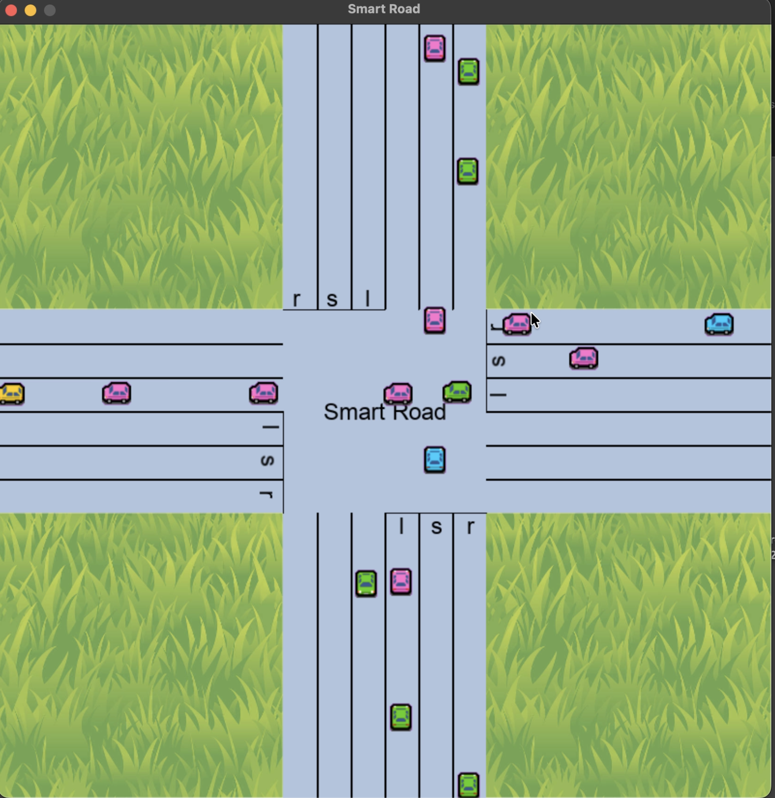

# Smart Road

A traffic intersection simulation built in Rust using SDL2 for graphics rendering. This project simulates vehicles navigating through a four-way intersection with collision detection and traffic management.

## Features

- **Interactive Traffic Simulation**: Spawn vehicles manually or automatically
- **Four-Way Intersection**: Vehicles can approach from North, South, East, and West directions
- **Collision Detection**: Smart collision avoidance system with safe distance calculations
- **Multiple Vehicle Types**: Different colored vehicles (Blue, Green, Pink, Yellow)
- **Traffic Statistics**: Track vehicle movements and intersection statistics
- **Keyboard Controls**: Full keyboard input for vehicle spawning and simulation control



### Platform Setup

#### macOS
```bash
brew install sdl2 sdl2_ttf sdl2_image
```

#### Linux
```bash
# Ubuntu/Debian
sudo apt-get install libsdl2-dev libsdl2-ttf-dev libsdl2-image-dev

#### Windows
Dependencies are bundled automatically via Cargo.

## Installation

1. Clone the repository:
```bash
git clone <repository-url>
cd smart-road
```

2. Build the project:
```bash
cargo build --release
```

3. Run the simulation:
```bash
cargo run --release
```

## Controls

### Vehicle Spawning
- **Arrow Keys**: Spawn vehicles from specific directions
  - `↑` (Up): Spawn vehicle from South going North
  - `↓` (Down): Spawn vehicle from North going South  
  - `←` (Left): Spawn vehicle from East going West
  - `→` (Right): Spawn vehicle from West going East

### Simulation Control
- **R**: Toggle random vehicle spawning mode
- **ESC**: Show statistics screen / Exit from statistics

## Project Structure

```
smart-road/
├── src/
│   ├── main.rs              # Main application entry point
│   ├── simulation.rs        # Simulation state management
│   ├── types.rs             # Core type definitions (Direction, VehicleColor, VehicleState)
│   ├── input/
│   │   ├── mod.rs           # Input module
│   │   └── keyboard.rs      # Keyboard input handling and vehicle spawning
│   ├── render/
│   │   ├── mod.rs           # Rendering module
│   │   ├── sdl2_manager.rs  # SDL2 window and canvas management
│   │   ├── vehicle.rs       # Vehicle rendering and state
│   │   └── intersection.rs  # Intersection rendering
│   └── traffic/
│       ├── mod.rs           # Traffic management module
│       ├── manager.rs       # Main traffic management logic
│       ├── lane.rs          # Lane definitions and management
│       └── collision.rs     # Collision detection system
├── assets/
│   ├── fonts/               # Font files for UI rendering
│   ├── roads/               # Road texture assets
│   └── vehicles/            # Vehicle sprite assets
├── Cargo.toml               # Rust project configuration
└── README.md               # This file
```

## Core Components

### Vehicle System
- Vehicles have unique IDs and states (Approaching, Waiting, Crossing, Exiting)
- Each vehicle tracks its position, direction, and destination
- Smart collision detection with configurable safe distances

### Traffic Management
- Automatic vehicle spawning with congestion detection
- Lane-based traffic flow management
- Statistics tracking for completed vehicles

### Rendering System
- SDL2-based graphics rendering
- Texture caching for performance
- Support for fonts and images

## Technical Details

### Dimensions
- Lane width: 35px
- Lane height: 295px  
- Vehicle width: 30px
- Window size: 800x800px

### Collision System
- Safe distance: 40px between vehicles
- Lane-specific spawn safety checks
- Close call detection for statistics

## Dependencies

- `rand`: Random number generation for vehicle spawning
- `sdl2`: Cross-platform multimedia library for graphics and input
- Platform-specific SDL2 features:
  - `image`: PNG image support
  - `ttf`: TrueType font rendering

## Contributing

1. Fork the repository
2. Create a feature branch
3. Make your changes
4. Test thoroughly
5. Submit a pull request

## License

This project is open source. Please see the LICENSE file for details.

## Future Enhancements

- Traffic light system
- Vehicle speed variation
- More complex intersection layouts
- Performance statistics and metrics
- Save/load simulation states
